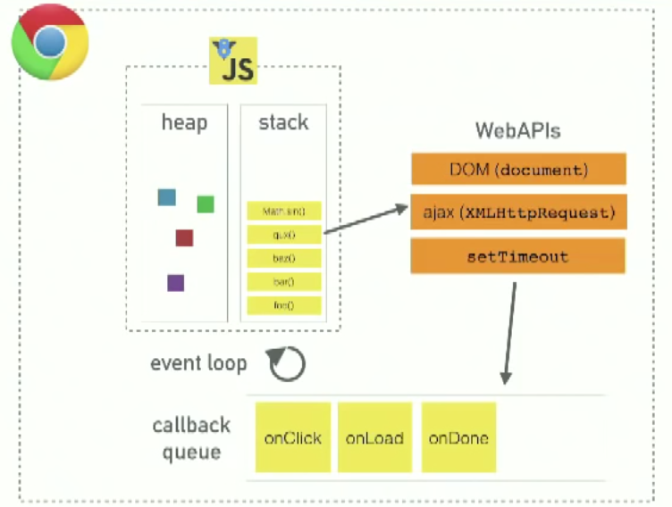

This is the question that this post will answer.

> ### Explain the difference between between asynchronous and synchronous and Javascript?

What is a program?

A program is able to allocate memory and parse and excute scripts(read and run commands).For javascript there is a **javascript enqine** which most browser implements. In _chrome it's v8_ and the v8 engine reads the javascript that we write in change into machine executable instruction in the browser.

The javascript engine consist of two parts **the memory heap** and **the call stack**. The memory heap is where the memory allocation happens wile the **callstack** is where your code is read and executed.

```javascript
//memory allocation
const a = 1
const b = 1
const c = 1
```

There is something that is called a **memory leak**. All we have done above there is created all the three global variables that re in the memory heap. And with all memory that we can actually have. Well memory leaks happens when you have unused memory such as in the heap, that is **having unused memory just laying around it fills up this memory heap**. This is why you hear that global variables
are bad expecially if you forget to clean them up. Whe the memory is fill up , eventually the browser will stop working.

### Call stack

With a call stack we could have something like

```javascript
console.log("1")
console.log("2")
console.log("3")
```

If I run the above code in my browser terminal. We will get **one**, **two** and **three** call stack. If you remember that's what is reads and executed our scripts. So what the call stack does it reads the first line console dialog. The javascript engine sees **console.log()** has been added. Let's pop it onto this call stack and then it runs it and creates one then it says OK I'm removing the first console.log() as i finished running it and place the second **console.log()** into my call
stack. After the excution of the second **console.log()** it removes it and add the last **console.log()** and repeates the process.

```javascript
const one = () => {
  const two = () => {
    console.log("Hi")
  }
  two()
}
```

Here we have nested funcitons. The javascript engine reads the function and creates a **call stack** as show. The first function **one()** is placed in the call stack, the second function **two()** is then placed in the callstack on the **callstack()** as show below.

```callstack
two()
one()
```

Remember that a stack uses the idea of **last in, fast out**. The **tw0()** function will be called the first one which will then run the **console.log(hi)**. After two() is run it is then removed form the call stack and the next function **one()** is the run. which is then removed from the call stack.

### Explain javascript is a single threaded language but it can be non-blocking?

Single threaded means that javascript only have **one callstack** while other languages are have multiple callstacks hence the name **multithreaded**. An one call stack can only do on thing at a time. Running code on a single thread can be quite easy since you don't have to deal with complicaed scenarios that arise in **multithreaded** environments. You just have one thing to worry about on thing. Issues of multithreaded are **deadlocks**.

## What does Syncronous Programming mean?

Executing statements in order, one statement runs and when it finishes the other statement is executed. Every statement called is waited for to finished excution. The advantage of synchronous programming is that its predictable but it can get really slow for operations like

1. Image processing
2. Making network requests like Api calls
3. Database

### What is stackOverflow?

The callstack get bigger and bigger until the space runs outs. Lets create a function overflow using recussion.

```javascript
//
function foo() {
  foo()
}
//maximumu callstack size is exceeded
```

### Problems of Syncronous Programming

When a statement takes alot of time to complete, it is going to hold up in line. This maked apps to be unresponsive or freeze. This is knowing as **blocking**. We need something non blocking.

#### Javascript is a single threaded language that can be non-blocking?

This is where asynchronous programing cames in. We dont have to wait out for task to finish to run the next task. let write asynchronous program below.

```javascript
console.log("Syncronous1")
setTimeout(() => console.log("Asyncronous1"), 5000)
console.log("Syncronous2")
```

When you run the code above, it seems like we skip the second statement. To run the last **console.log("Syncronous2")** This is what is called Asyncronous programming, we don't have to wait for the 5000 milisecond delay to run the last staement.

#### How is this possible using Javascript

In order for this to be possible with javascript we have to have something more except for the javascript engine, this is called **javascript Run-Time Environment**. This is part of the browser. On top of the engine the have the following.

1. Web Apis (Dom document, Ajax, setTimeout)
2. Event Loop
3. Callback Queue



##### Let figure out the above how the above code was run

    console.log("Syncronous1") // run first // popped 1
    setTimeout(() => console.log("Asyncronous1"), 5000) // added // triggers webapi // popped 2
    console.log("Syncronous1") // run // popped 1 // empty
    // callstack is empty

    // CALL STAcK

    setTimeout(5000) // setup the timer for 5 second // sets up a callback // when time is over //
    creates callback
    // WEB API

    callback() // created by web api
    // CALLBACK QUEUS

    // checks if callstack is empty // do we have callbacks // yes callstack is empty // callback() //
    placed in callstack
    // EVENT LOOP
